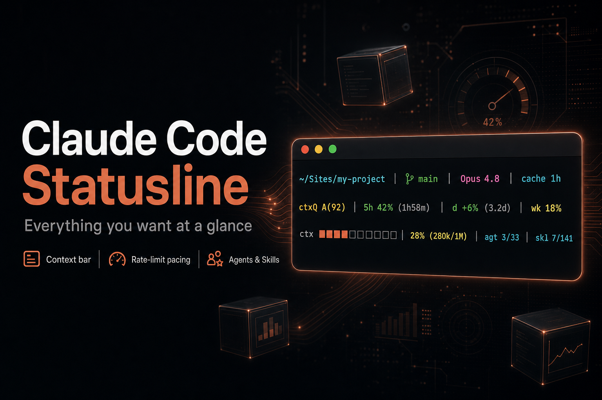

<p align="center">
  
</p>

<p align="center">
  <a href="LICENSE"></a>
  
  
  
</p>

# claude-code-statusline

A drop-in status line for [Claude Code](https://claude.com/claude-code) that puts everything you actually glance at on **two tidy lines**: where you are and what you're running up top, and every live metric — context window, rate limits, weekly pacing, sub-agents and skills — underneath.

A single `bash` script, one `jq` pass per refresh. No daemon, no config file, no dependencies beyond `jq`.

> Unofficial. Not affiliated with or endorsed by Anthropic. It reads the JSON that Claude Code already pipes to its status line command — nothing else.

```
~/Sites/my-project   main   Opus 4.8   cache 1h
ctxQ A(92)   5h 42% (1h58m)   d +6% (3.2d)   wk 18%   ctx ███░░░░░░░ 28% (280k/1M)   agt 3/33   skl 7/141
```

Segments only appear when there's something to show — a fresh session in a non-git directory is just the path and the model, nothing else.

## Two lines, two jobs

| Line | Question it answers | Segments |
|------|---------------------|----------|
| **Context** | Where am I, on what? | directory · git branch · model · prompt-cache TTL · vim mode |
| **Metrics** | What am I burning, and how fast? | context quality · 5h limit · daily pacing · weekly · weekly-opus · context window · agents · skills |

The split is the point: the top line is stable and rarely changes within a session, the bottom line moves on every turn. Your eye learns where to look.

## Segments

| Segment | Example | When it shows |
|---------|---------|---------------|
| Directory | `~/Sites/my-project` | always (home collapsed to `~`) |
| Git | ` main` | in a git repo |
| Model | `Opus 4.8` | always |
| Prompt-cache | `cache 1h` | always — `1h` if `ENABLE_PROMPT_CACHING_1H` is set, else `5m` |
| Vim mode | `[NORMAL]` | when vim mode is enabled |
| Context quality | `ctxQ A(92)` | when a token-optimizer score exists for the session |
| 5h limit | `5h 42% (1h58m)` | when present — percentage used + time left until reset |
| Daily pacing | `d +6% (3.2d)` | when the weekly limit is present |
| Weekly | `wk 18%` | when present |
| Weekly Opus | `wk-opus 7%` | when present |
| Context window | `ctx ███░░░░░░░ 28% (280k/1M)` | progress bar, green → yellow → red as it fills |
| Agents | `agt 3/33 +1bg` | in-flight `used/available`, `+Nbg` for background agents still running |
| Skills | `skl 7/141` | skills invoked this session / total installed |

Every percentage colours itself: green under 50%, yellow from 50%, red from 80%.

### `5h 42% (1h58m)` — the countdown

The five-hour rate limit shows both the percentage used **and** how long until it resets, read from `resets_at` in the payload. Under an hour it collapses to minutes (`(42m)`). You can see at a glance whether to push on or wait it out.

### `d +6% (3.2d)` — daily pacing

The weekly limit is your real budget. Spend it evenly and you "earn" one-seventh (~14.3%) of it per day. The `d` segment compares where you *should* be (by elapsed time) against where you *are* (`wk`):

- **`+6%`** — under budget, money in the bank. Green.
- **`-8%`** — over budget, burning ahead of pace. Yellow.
- **`-20%`** — more than a full day ahead of pace. Red.

The trailing `(3.2d)` is how much of the week is left before the limit resets. It turns an abstract "18% used" into "am I going to run out before Friday?"

### `ctxQ A(92)` — context quality

If you run a token-optimizer plugin that scores context health, its `UserPromptSubmit` hook writes a grade to `~/.claude/token-optimizer/quality-cache-<session>.json` every couple of minutes. The segment surfaces that grade and score (`A(92)`), coloured green/yellow/orange/red by band. No file, no segment — it stays out of the way.

### How `agt` and `skl` are counted

- **Used is in-flight, not cumulative.** The script parses the session transcript (`transcript_path`) and counts `Task`/`Agent` and `Skill` tool calls that have **no matching `tool_result` yet** — i.e. work that's actually running right now, not everything you've ever launched. Idle session → `0`.
- **`+Nbg`** counts the in-flight `Task` calls dispatched with `run_in_background: true`.
- **Available** is every installed sub-agent (`~/.claude/agents/`, project `.claude/agents/`, plugin agents) and skill (`SKILL.md` files in the same places). Scanning the plugin cache is slow, so this is cached for 5 minutes per working directory.

## Install

```bash
# 1. Drop the script anywhere on disk
curl -fsSL https://raw.githubusercontent.com/Dakaric/claude-code-statusline/main/statusline.sh \
  -o ~/.claude/statusline.sh
chmod +x ~/.claude/statusline.sh
```

Then wire it up in `~/.claude/settings.json` (create the file if it doesn't exist):

```json
{
  "statusLine": {
    "command": "~/.claude/statusline.sh"
  }
}
```

The next Claude Code session picks it up. That's the whole install.

### Requirements

- `bash` — any modern version
- `jq` — `brew install jq` (macOS) or `apt install jq` (Debian/Ubuntu)
- A terminal with ANSI colour and basic Unicode (block characters for the progress bar)

## How it works

Claude Code pipes a JSON object to the status line command on every refresh. The script makes one read of the fields it needs:

| Field | Drives |
|-------|--------|
| `workspace.current_dir` / `cwd` | directory, git branch |
| `model.display_name` | model |
| `context_window.{context_window_size, used_percentage, current_usage}` | context window bar |
| `rate_limits.{five_hour, weekly, weekly_opus}.used_percentage` | 5h / weekly / weekly-opus |
| `rate_limits.*.resets_at` | the 5h countdown and daily-pacing maths |
| `transcript_path` | agent / skill counts |
| `vim.mode` | vim indicator |

Rate-limit keys drift between CLI versions (`weekly` vs `seven_day`), so the script takes the **max** of the known aliases instead of trusting one. The transcript is parsed in a single `jq` pass; available agent/skill counts are cached at `$TMPDIR/claude-statusline-avail-<cwd-hash>.cache`.

### Rate-limit snapshot

The Claude Code Agent SDK doesn't expose rate-limit usage — only this status line payload carries it. So on every refresh the script also tees a small snapshot to `~/.claude/jarvis-rate-limits.json`:

```json
{ "rate_limits": { ... }, "captured_at": 1751021400 }
```

Handy if you want an external tool or dashboard to read your current usage. Delete the two `jq`/`echo` lines near the top if you don't want it written.

## Customizing

Every segment is its own block and the colour palette sits at the top of the script. Common tweaks:

- **Colours** — edit the `C_*` ANSI variables near the top.
- **Re-order or drop a segment** — change the `join_segs` argument lists at the bottom (`line1` / `line2`). Move a segment between lines, or delete it from both.
- **Go back to one line** — put every segment into a single `join_segs` call.
- **Bar width** — change `width=10` in `make_bar()`.
- **Avail-cache TTL** — the `300` (seconds) literal in the agents/skills block.

## Uninstall

Remove the `statusLine` entry from `~/.claude/settings.json` (or restore your previous one) and delete the script.

## License

MIT — see [LICENSE](LICENSE).
